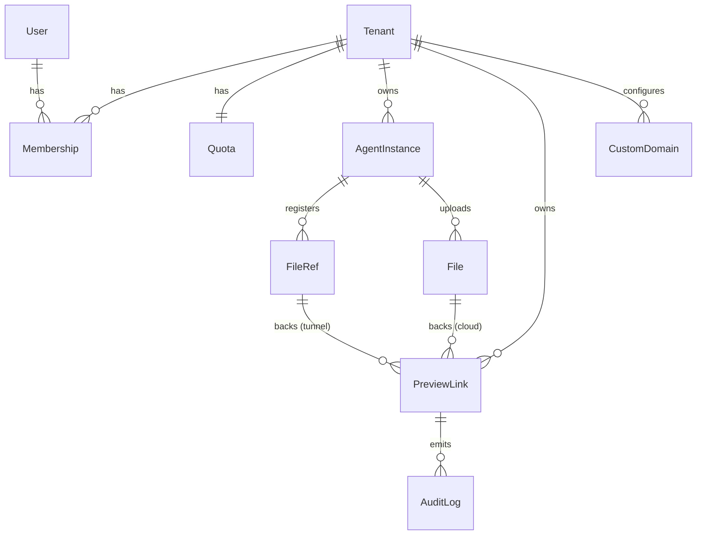
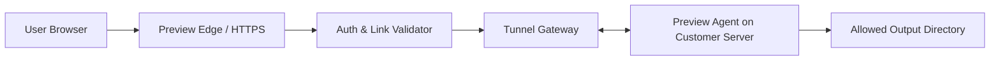
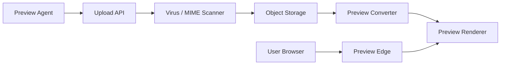
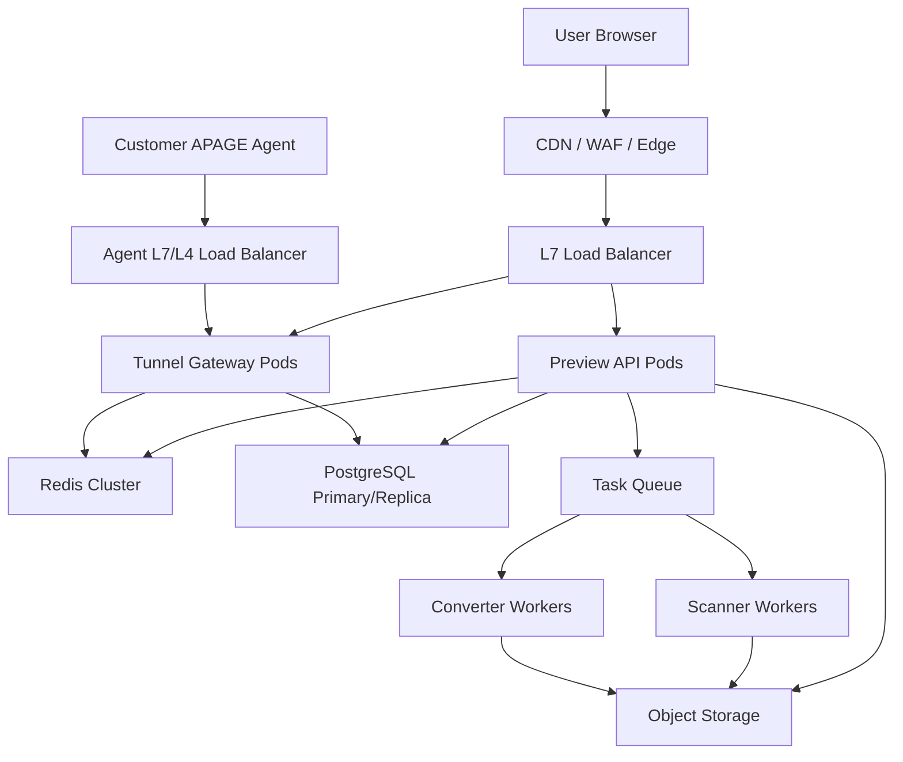
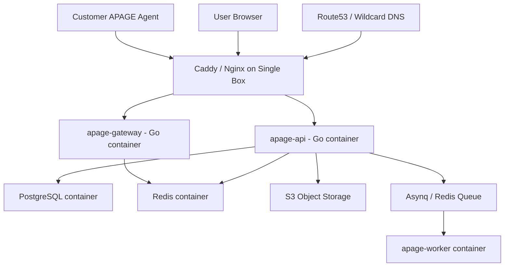

下面是一份可直接拿去拆 PRD/技术设计的 spec。产品名为 **APAGE**。

# APAGE Spec

## 1. 产品目标

为部署在客户服务器、开发环境或云端环境中的 Agent 提供文件预览、临时分享和二级域名访问能力。

APAGE 的服务对象包括：

```text
OpenClaw
Hermes Agent
一切需要预览和分享文件、报告、图片、网页、日志或中间产物的 Agent
```

APAGE 不是某个单一 Agent 的附属模块，而是面向 Agent 生态的通用 Preview & Share Provider。

支持两种方案：

1. **DNS + Tunnel**
   文件保留在客户服务器，不上传到平台。平台提供二级域名、TLS、鉴权、临时映射和反向隧道转发。

2. **DNS + Tunnel + Cloud**
   同时支持本地隧道预览和云端托管预览。客户可以选择把文件上传到平台，由平台负责存储、转换、预览、分享和过期清理。

---

## 2. 核心概念

实体关系总览：



```text
Tunnel 模式：PreviewLink.file_ref -> FileRef（文件留在客户服务器）
Cloud 模式：PreviewLink.file_id -> File（文件托管在平台）
一个 File 或 FileRef 可对应多个 PreviewLink
访问准入由 PreviewLink.access_policy + 三层 expires 共同决定
```

### Tenant

客户组织或个人账户。

```text
tenant_id
name
plan: lite | starter | pro | team
trust_level: new | basic | trusted
created_at
```

### User

平台登录用户。一个 User 可属于多个 Tenant，权限由 Membership 决定。

```text
user_id
email
email_verified_at
auth_provider: password | oauth
created_at
```

### Membership

User 与 Tenant 的成员关系，承载 RBAC。

```text
membership_id
user_id
tenant_id
role: owner | admin | member | viewer
created_at
```

角色权限：

```text
owner: 全部权限，含计费、删除租户、管理成员
admin: 管理实例、链接、文件、自定义域名、查看审计日志、处置滥用
member: 创建/撤销自己的链接，查看本租户资源
viewer: 只读，查看实例状态和链接列表
账户级访问策略（14 节 account.allowedUserIds）引用的是 user_id
后台 API 鉴权 = 用户登录态 -> 解析 Membership -> 校验 role
```

### Quota / Usage

按租户记录套餐限额与实时用量，作为限流和计费的依据。

```text
tenant_id
plan
instance_limit          每租户最大实例数
storage_bytes_limit     Cloud 存储上限
storage_bytes_used      当前已用存储
tunnel_egress_limit     tunnel 转发流量上限（按计费周期）
cloud_egress_limit      Cloud 下载流量上限（按计费周期）
conversion_limit        转换次数上限
custom_domain_limit     自定义域名数上限
period_start            当前计费周期起点
```

用量校验点：

```text
presign / 上传前校验 storage 与文件大小（见 12 节）
创建实例前校验 instance_limit
创建自定义域名前校验 custom_domain_limit
egress 累计接近上限时按 19.6 限流降级
用量计数走 Redis 缓冲，异步 flush（见 19.7），但硬上限判定与 maxViews 同属强一致路径
超出免费额度按套餐策略处理：提示升级或拒绝，不静默产生费用（见 20 节 Lite 边界）
```

### Agent Instance

一个客户部署或运行的 Agent 实例，例如 OpenClaw、Hermes Agent 或其他接入 APAGE 的 Agent。

```text
instance_id
tenant_id
agent_type: openclaw | hermes | custom
agent_name
subdomain
mode: tunnel | cloud | hybrid
status: online | offline
agent_version
last_seen_at
created_at
```

### Preview Agent

运行在客户服务器、开发机或 Agent runtime 旁边的轻量服务。

职责：

```text
连接平台 Tunnel Gateway
限制可访问目录
校验本地文件路径
读取文件 metadata
流式传输文件
上传文件到 Cloud Storage，可选
```

### Preview Link

对外分享的预览链接。

```text
link_id
tenant_id
instance_id
file_ref          mode=tunnel 时使用，引用 FileRef
file_id           mode=cloud 时使用，引用 File
mode: tunnel | cloud
secret_hash
expires_at
access_policy
revoked_at
frozen_at         滥用治理冻结时间（见 15.5），与 revoked_at 区分
frozen_reason
created_at
last_accessed_at
view_count
```

说明：

```text
link_id 可以出现在 URL 中，用于定位记录
file_ref 与 file_id 二选一，由 mode 决定，schema 中均可空，应用层校验互斥
secret 只能以 hash 形式保存，不能明文落库
访问 URL 不使用 query token，避免被日志、Referer、截图或浏览器历史泄露
revoked = 用户主动撤销；frozen = 平台滥用治理冻结，二者独立，访问均失效
```

### File Ref

Preview Link 不应长期保存客户机器上的原始路径。Tunnel 模式下推荐由 Agent 生成 opaque file_ref。

```text
file_ref
instance_id
local_path_hash
display_name
size
mime_type
modified_at
created_at
expires_at
```

规则：

```text
file_ref 只在对应 instance 内有效
平台不能通过 file_ref 推导客户本地路径
Agent 本地保存 file_ref -> canonical local path 映射
Agent 重启后可从本地小型数据库恢复映射
file_ref 过期后 Agent 和平台都应清理
```

### 统一 API 约定

认证：

```text
实例侧 API 使用 instance_api_key
用户后台 API 使用用户登录态或 OAuth token
Agent tunnel 使用 agent_token + session key
本机 Agent API 只监听 127.0.0.1，必要时再加本机随机 bearer token
```

凭证生命周期与泄露处置：

```text
instance_api_key 和 agent_token 支持轮换：可签发新 key，旧 key 进入宽限期后失效
轮换和撤销 API 仅 owner/admin 可调用，动作写入审计日志
撤销 agent_token 必须立即断开该 token 的所有活跃 tunnel session
密钥只在创建时明文返回一次，平台仅保存 hash
泄露处置（blast radius）：
  instance_api_key 泄露 -> 撤销并轮换，受影响范围限于该 instance
  agent_token 泄露 -> 撤销并断连，攻击者无法新建 session
  泄露不影响已签发链接的 secret，但应排查异常链接并按需批量撤销
device_fingerprint 仅用于异常连接检测和重连去重，不用于用户追踪
  指纹基于稳定的设备/安装标识，不采集 PII，可在隐私说明中披露
```

幂等：

```text
创建文件、创建链接、完成上传等写接口支持 Idempotency-Key
同一个 Idempotency-Key 在 24 小时内返回相同结果
幂等键按 tenant_id + instance_id + endpoint 隔离
```

分页与列表约定：

```text
所有列表接口统一使用 cursor / keyset 分页，不使用 offset，避免大数据量下偏移退化
请求参数：limit（默认 20，最大 100）、cursor（不透明游标）、order（asc | desc，默认 desc）
游标基于稳定排序键（通常是 created_at + id），平台内部编码，调用方不可解析
列表只返回当前租户可见资源，跨租户资源一律视为不存在
```

列表响应 envelope：

```json
{
  "items": [],
  "nextCursor": "cursor_opaque_or_null",
  "hasMore": true
}
```

限流响应约定：

```text
触发限流返回 429，并带 Retry-After（秒）
建议同时返回 RateLimit-Limit / RateLimit-Remaining / RateLimit-Reset 头
```

通用错误响应：

```json
{
  "error": {
    "code": "ACCESS_DENIED",
    "message": "The preview link is expired or revoked",
    "requestId": "req_123",
    "retryable": false
  }
}
```

常见 HTTP 状态：

```text
400: 参数错误
401: 未认证
403: 无权限或策略拒绝
404: 资源不存在，避免暴露跨租户资源
409: 状态冲突，例如重复 complete
410: 链接或文件已过期
413: 文件过大
415: 文件类型不支持
429: 触发限流
500: 服务端错误
503: Agent offline 或依赖服务不可用
```

---

# 方案 A：DNS + Tunnel

## 3. 方案目标

客户文件不上传到平台存储。平台为每个 Agent Instance 提供二级域名和临时访问通道。

示例：

```text
https://alice.preview.example.com/p/abc123
```

访问时：

```text
Browser
  -> Preview Gateway
  -> Tunnel Gateway
  -> Customer Preview Agent
  -> Customer file
```

注意：此模式下平台不落盘保存文件，但如果使用 relay tunnel，文件字节会经过平台网关转发。

---

## 4. DNS + Tunnel 架构



---

## 5. DNS 和域名

每个实例分配二级域名：

```text
<instance>.preview.example.com
```

可选支持客户自定义域名：

```text
preview.customer.com
```

DNS 模式：

```text
Wildcard DNS:
*.preview.example.com -> Preview Edge

Custom Domain:
preview.customer.com CNAME customer-id.preview.example.com
```

TLS：

```text
默认使用 wildcard certificate
自定义域名使用 ACME 自动签证书
```

自定义域名验证：

```text
1. 用户添加 custom domain
2. 平台生成 TXT 验证值
3. 用户添加 TXT 记录证明域名所有权
4. 用户添加 CNAME 指向平台
5. 平台签发证书并激活域名
6. 定期检查 DNS 和证书状态
```

示例：

```text
_apage.preview.customer.com TXT apage-domain-verify=xxx
preview.customer.com CNAME customer-id.preview.example.com
```

---

## 6. Preview Agent

### 6.1 安装方式

```bash
curl -fsSL https://preview.example.com/install.sh | sh

apage-agent init \
  --instance alice \
  --agent-type openclaw \
  --workspace ~/.openclaw/workspace/outputs
```

Hermes Agent 示例：

```bash
apage-agent init \
  --instance hermes-prod \
  --agent-type hermes \
  --workspace ~/.hermes/outputs
```

安装与二进制完整性：

```text
install.sh 与 apage-agent 二进制必须发布 SHA256 checksum 和签名（minisign / cosign）
安装脚本默认在执行前校验 checksum，校验失败即中止
推荐文档同时提供「下载 + 手动校验 + 安装」的非管道方式，供安全敏感客户使用
发布渠道使用固定版本化 URL，避免 latest 被悄悄替换
```

升级与版本管理：

```text
Agent 支持自动更新，更新包同样校验签名后才落地
平台维护 Agent 最低支持版本，低于下限的 Agent 连接被拒绝并提示升级
agent_version 在连接时上报，平台据此做兼容性路由和强制升级
安全补丁可标记为强制更新，Agent 在宽限期后必须升级才能继续服务
```

### 6.2 启动方式

```bash
apage-agent start \
  --token apage_xxx \
  --workspace ~/.openclaw/workspace/outputs
```

### 6.3 安全限制

Agent 默认只允许访问 allowlist 目录：

```text
OpenClaw: ~/.openclaw/workspace/outputs
Hermes Agent: ~/.hermes/outputs
Custom Agent: 由接入方本地配置
```

禁止：

```text
访问 Agent home 整体目录
访问 AGENTS.md / MEMORY.md / config / credentials
路径穿越：../../secret
符号链接逃逸
隐藏文件，默认禁止
可执行文件预览，默认禁止
```

路径校验规则：

```text
1. 将用户输入路径解析为绝对路径
2. 做 Unicode normalization 和平台相关大小写规范化
3. realpath 解析符号链接
4. 确认 realpath 位于 allowlist root 内
5. 打开文件后再次 fstat 校验 inode/device，避免 TOCTOU
6. 拒绝目录、socket、device、FIFO 等非普通文件
7. 拒绝超过租户或实例限制的文件
```

allowlist 变更规则：

```text
allowlist 目录只能在客户服务器本地配置
管理后台只能展示 Agent 上报的 allowlist，不能远程扩大目录范围
如需远程变更，必须要求本机确认或重新签发 Agent 配置
```

### 6.4 本地文件注册

Agent CLI / MCP tool / SDK 推荐先调用本机 APAGE Agent 注册文件，再让平台创建分享链接。

```http
POST http://127.0.0.1:<agent_port>/local/v1/files/register
Content-Type: application/json
```

Request:

```json
{
  "path": "outputs/report.pdf",
  "displayName": "report.pdf",
  "expiresInSeconds": 3600
}
```

Response:

```json
{
  "fileRef": "fref_123",
  "displayName": "report.pdf",
  "size": 183204,
  "mimeType": "application/pdf",
  "modifiedAt": "2026-06-22T10:00:00Z"
}
```

平台 API 只接收 `fileRef` 和 metadata。原始路径不上传到平台，除非客户明确开启 debug 模式。

---

## 7. Tunnel 协议

Agent 主动出站连接平台，避免客户服务器需要公网 IP。

连接方式：

```text
WebSocket over TLS
或 HTTP/2 long-lived stream
```

连接认证：

```text
agent_token
instance_id
device_fingerprint
rotating session key
```

连接握手时 Agent 上报协议版本与能力，平台据此协商：

```text
Agent 在 connect 帧携带 protocolVersion、agentVersion、capabilities
平台校验 protocolVersion 是否在支持区间，低于下限直接拒绝并提示升级
能力按交集协商，未知能力忽略，保证向后兼容
协议演进采用语义化版本，破坏性变更提升 major
```

连接建立后，平台返回本次会话参数：

```json
{
  "type": "session.accepted",
  "sessionId": "sess_123",
  "protocolVersion": "1",
  "maxConcurrentStreams": 16,
  "maxChunkBytes": 262144,
  "idleTimeoutSeconds": 60
}
```

心跳：

```text
ping interval: 15s
offline timeout: 45s
```

请求流程：

```text
1. 用户访问 preview link
2. Preview Gateway 校验 token / expiry / policy
3. Gateway 通过 tunnel 向 Agent 请求文件
4. Agent 校验路径和权限
5. Agent 返回 metadata
6. Gateway 设置响应头并流式传输文件
```

协议要求：

```text
控制帧使用 JSON
文件内容使用 binary frame 或 HTTP/2 data frame
每个请求必须带 requestId
每个 stream 必须支持 cancel
Gateway 必须向 Agent 传递 backpressure，避免大文件占满内存
单实例并发、单租户并发和单链接并发都必须限流
```

标准错误：

```json
{
  "requestId": "req_123",
  "ok": false,
  "error": {
    "code": "FILE_NOT_FOUND",
    "message": "File ref is expired or not found",
    "retryable": false
  }
}
```

错误码：

```text
FILE_NOT_FOUND
FILE_EXPIRED
ACCESS_DENIED
FILE_TOO_LARGE
UNSUPPORTED_TYPE
RANGE_NOT_SATISFIABLE
AGENT_BUSY
AGENT_OFFLINE
STREAM_CANCELLED
INTERNAL_ERROR
```

---

## 8. Tunnel API

### 创建预览链接

```http
POST /api/v1/preview-links
Authorization: Bearer <instance_api_key>
Idempotency-Key: <client_generated_key>
Content-Type: application/json
```

Request:

```json
{
  "mode": "tunnel",
  "fileRef": "fref_123",
  "expiresInSeconds": 3600,
  "displayName": "report.pdf",
  "accessPolicy": {
    "type": "public_token",
    "allowDownload": true
  }
}
```

Response:

```json
{
  "linkId": "plink_123",
  "url": "https://alice.preview.example.com/p/plink_123/aps_xxx",
  "expiresAt": "2026-06-22T12:00:00Z"
}
```

URL 规则：

```text
plink_123 是公开定位 ID
aps_xxx 是高熵 secret，只能出现在 path segment 中
平台只保存 secret_hash
服务端日志、访问日志、错误日志必须对 secret path segment 脱敏
跳转到第三方资源时必须使用 Referrer-Policy: no-referrer
```

ID 与 secret 编码规范：

```text
所有公开定位 ID（plink_、file_、fref_ 等）必须随机生成、不可枚举，禁止自增序列
secret 至少 128 bit entropy，使用 CSPRNG 生成
secret 编码为 base62 或 base64url（无填充），前缀标识用途：
  aps_ = preview link secret（预览链接）
  afs_ = file secret（Cloud 文件直链）
secret 只比对 hash，且使用常量时间算法（见 14 节）
ID 前缀仅用于人类可读和路由，不承载任何机密性
```

### Agent 文件 metadata 请求

平台内部调用：

```json
{
  "type": "file.metadata",
  "requestId": "req_123",
  "fileRef": "fref_123"
}
```

Agent 返回：

```json
{
  "requestId": "req_123",
  "ok": true,
  "file": {
    "name": "report.pdf",
    "size": 183204,
    "mimeType": "application/pdf",
    "modifiedAt": "2026-06-22T10:00:00Z"
  }
}
```

### Agent 文件流请求

```json
{
  "type": "file.stream",
  "requestId": "req_124",
  "fileRef": "fref_123",
  "range": "bytes=0-"
}
```

Agent 流响应：

```json
{
  "type": "file.stream.start",
  "requestId": "req_124",
  "ok": true,
  "status": 206,
  "headers": {
    "Content-Type": "application/pdf",
    "Content-Length": "183204",
    "Content-Range": "bytes 0-183203/183204",
    "Accept-Ranges": "bytes"
  }
}
```

随后发送二进制 chunk：

```text
requestId=req_124
sequence=1..n
bytes=<binary>
```

结束帧：

```json
{
  "type": "file.stream.end",
  "requestId": "req_124",
  "bytesSent": 183204,
  "sha256": "optional_sha256"
}
```

---

# 方案 B：DNS + Tunnel + Cloud

## 9. 方案目标

在 Tunnel 基础上增加云端托管能力。客户可选择：

```text
本地预览：文件留在客户服务器
云端预览：文件上传到平台
混合预览：小文件上传，大文件走 tunnel
```

---

## 10. Cloud 架构



---

## 11. Cloud 存储

推荐使用对象存储：

```text
S3
Cloudflare R2
MinIO
Aliyun OSS
Tencent COS
```

对象 key：

```text
tenant_id/instance_id/file_id/original
tenant_id/instance_id/file_id/preview.pdf
tenant_id/instance_id/file_id/thumb.webp
```

元数据放 PostgreSQL。

文件状态：

```text
created: 已创建 file 记录，等待上传
uploading: 已签发上传地址
uploaded: 对象存储已收到文件
scanning: 病毒扫描中
rejected: 扫描失败或类型不允许
converting: 预览转换中
ready: 可预览
failed: 转换或处理失败
expired: 已过期，不再可访问
deleted: 原文件和衍生产物已删除
```

过期与删除：

```text
expires_at 控制访问链接和文件保留时间，默认取租户策略
撤销 Preview Link 只让链接不可访问，不默认删除 Cloud 文件
删除 File 会删除 original、preview、thumb 等所有对象
过期任务至少每小时扫描一次
对象删除失败必须重试，并保留 tombstone 记录
审计日志默认保留 90 天，可按套餐调整
```

三层过期优先级（file_ref、file、preview_link 各有 expires_at）：

```text
有效访问窗口 = 三者中最早的过期时间（most restrictive wins）
任意一层过期，访问即失效，返回 410
Tunnel 模式：file_ref 过期 -> 链接不可用，即使 link 本身未过期
Cloud 模式：file 过期或删除 -> 其上所有 preview_link 级联立即失效
创建 link 时若 expiresInSeconds 超过底层 file/file_ref 的剩余寿命，按底层裁剪并在响应中返回实际 expiresAt
```

---

## 12. Cloud API

### 上传文件

小文件直传入口。大文件必须改用预签名上传（见下一节）。

```http
POST /api/v1/files
Authorization: Bearer <instance_api_key>
Idempotency-Key: <client_generated_key>
Content-Type: multipart/form-data
```

Fields:

```text
file
displayName
expiresInSeconds
visibility: private | link
```

直传与预签名的选择阈值：

```text
size <= DIRECT_UPLOAD_MAX_BYTES（默认 8 MiB）可走 multipart 直传
size > DIRECT_UPLOAD_MAX_BYTES 必须走 presign，否则返回 413
阈值由租户套餐和服务端配置决定，作为常量对外公布
```

Response:

```json
{
  "fileId": "file_123",
  "status": "scanning",
  "previewStatus": "pending",
  "expiresAt": "2026-06-23T12:00:00Z"
}
```

说明：

```text
上传成功不代表立即可预览，文件先进入 scanning，再按类型进入 converting/ready
只有 status=ready 后才会签发可访问的 preview URL，因此本响应不返回 url
调用方应轮询 GET /api/v1/files/{fileId} 或订阅事件，待 ready 后再创建 Cloud 预览链接
任何上传路径返回的初始 status 都不会是 ready
```

### 创建预签名上传

```http
POST /api/v1/uploads/presign
Authorization: Bearer <instance_api_key>
Idempotency-Key: <client_generated_key>
Content-Type: application/json
```

Request:

```json
{
  "fileName": "report.pdf",
  "mimeType": "application/pdf",
  "size": 183204
}
```

Response:

```json
{
  "uploadUrl": "https://storage.example.com/...",
  "fileId": "file_123",
  "headers": {
    "Content-Type": "application/pdf"
  }
}
```

约束：

```text
uploadUrl 默认 15 分钟过期
presign 前必须校验租户配额、文件大小、MIME allowlist
上传完成前不能创建可访问链接
客户端必须按返回 headers 上传，否则 finalize 失败
```

### 完成预签名上传

```http
POST /api/v1/uploads/file_123/complete
Authorization: Bearer <instance_api_key>
Idempotency-Key: <client_generated_key>
Content-Type: application/json
```

Request:

```json
{
  "etag": "\"abc123\"",
  "size": 183204,
  "sha256": "optional_sha256"
}
```

Response:

```json
{
  "fileId": "file_123",
  "status": "scanning",
  "previewStatus": "pending"
}
```

### 查询文件状态

```http
GET /api/v1/files/file_123
Authorization: Bearer <instance_api_key>
```

Response:

```json
{
  "fileId": "file_123",
  "status": "ready",
  "previewStatus": "ready",
  "displayName": "report.pdf",
  "size": 183204,
  "mimeType": "application/pdf",
  "expiresAt": "2026-06-23T12:00:00Z"
}
```

### 创建 Cloud 预览链接

```http
POST /api/v1/preview-links
Authorization: Bearer <instance_api_key>
Idempotency-Key: <client_generated_key>
Content-Type: application/json
```

Request:

```json
{
  "mode": "cloud",
  "fileId": "file_123",
  "expiresInSeconds": 86400
}
```

Response:

```json
{
  "linkId": "plink_456",
  "url": "https://alice.preview.example.com/p/plink_456/aps_xxx",
  "expiresAt": "2026-06-23T12:00:00Z"
}
```

创建规则：

```text
只有 status=ready 的文件可以创建 Cloud 预览链接
rejected / failed / expired / deleted 文件必须返回明确错误
同一个 file 可以创建多个 Preview Link
每个 Preview Link 可独立撤销、设置密码和过期时间
```

---

## 13. 文件预览能力

### MVP 支持

```text
PDF: 浏览器原生预览
PNG/JPEG/WebP/GIF: 图片预览
TXT/MD/JSON/CSV/LOG: 文本预览
HTML: 默认下载或以 sandbox iframe 预览，需租户显式开启
```

### V1 支持

```text
DOCX/PPTX/XLSX -> LibreOffice 转 PDF
CSV -> 表格预览
Markdown -> 安全 HTML
代码文件 -> syntax highlight
```

### 高风险类型

默认不直接执行或渲染：

```text
EXE
SH
JS
HTML with JS
SVG with script
ZIP contents auto-render
```

HTML/SVG 必须 sandbox，并移除危险能力。

渲染隔离：

```text
用户上传 HTML/SVG 不在主应用域名渲染
使用独立渲染域名，例如 render.preview.example.com
iframe sandbox 默认不允许 allow-scripts 和 allow-same-origin
HTML 预览必须注入严格 CSP
SVG 默认转为安全图片或纯文本展示
无法安全处理的文件类型只允许下载或拒绝
```

---

## 14. 权限模型

Preview Link 支持：

```text
public_token: 有链接即可访问
password: 链接 + 密码
account: 必须登录平台账户
ip_allowlist: 指定 IP 可访问
single_use: 一次性链接
download_disabled: 只预览不可下载，尽力而为
```

字段：

```json
{
  "accessPolicy": {
    "type": "public_token",
    "allowDownload": true,
    "ipAllowlist": [],
    "maxViews": 100,
    "singleUse": false,
    "passwordRequired": false
  }
}
```

完整 schema：

```json
{
  "type": "public_token",
  "allowDownload": true,
  "ipAllowlist": ["203.0.113.0/24"],
  "maxViews": 100,
  "singleUse": false,
  "password": {
    "enabled": false,
    "hash": "argon2id_hash",
    "attemptLimit": 5
  },
  "account": {
    "required": false,
    "allowedTenantIds": [],
    "allowedUserIds": []
  }
}
```

规则：

```text
配额型计数与统计型计数走不同一致性路径，不能混用：
  强一致路径：single_use 和 maxViews 是访问准入门槛，必须在放行前同步原子判定与消费
    实现用 Redis Lua 或 INCR 后比较，超过上限立即拒绝，禁止异步缓冲后补判
    single_use 等价于 maxViews=1，并且必须防并发重复消费
  最终一致路径：纯展示用的 view_count / last_accessed_at 可先写 Redis 再异步 flush（见 19.7）
  即同一次访问可能两路都计数：先过强一致门槛放行，再异步累加统计值
password 只保存强哈希，禁止明文落库
password 错误必须限流，避免暴力破解
secret 与 password 比对必须使用常量时间算法，避免时序侧信道
ip_allowlist 需明确是否信任 X-Forwarded-For，只信任自家 Edge 注入的头
download_disabled 只是尽力而为，不能作为强 DRM 承诺
```

撤销链接：

```http
POST /api/v1/preview-links/plink_123/revoke
Authorization: Bearer <instance_api_key>
```

Response:

```json
{
  "linkId": "plink_123",
  "revokedAt": "2026-06-22T11:00:00Z"
}
```

### 列表与查询 API

供管理后台和实例侧使用，全部遵循上文的 cursor 分页与列表 envelope 约定。

列出预览链接：

```http
GET /api/v1/preview-links?limit=20&cursor=<c>&status=active
Authorization: Bearer <instance_api_key>
```

```text
过滤项：status（active | revoked | expired）、instanceId、mode
排序键：created_at desc
items 中不返回 secret，只返回 linkId、locator、状态和统计字段
```

列出 Cloud 文件：

```http
GET /api/v1/files?limit=20&cursor=<c>&status=ready
Authorization: Bearer <instance_api_key>
```

```text
过滤项：status（见 11 节文件状态）、instanceId
排序键：created_at desc
```

查询审计日志：

```http
GET /api/v1/audit-logs?limit=50&cursor=<c>&event=preview_link.accessed
Authorization: Bearer <user_session_or_oauth_token>
```

```text
过滤项：event、resourceType、resourceId、actorType、时间区间 from/to
排序键：created_at desc
secret path segment 一律脱敏，不出现在返回中
仅租户管理员可访问
```

---

## 15. 安全要求

必须实现：

```text
短期 token
高熵 secret，不少于 128 bit entropy
secret 只保存 hash
URL query 不承载访问 secret
日志脱敏 secret path segment
链接可撤销
文件大小限制
租户级限流
MIME sniffing
路径规范化
禁止路径穿越
禁止符号链接逃逸
上传病毒扫描
Office 转换隔离容器
HTML sandbox
审计日志
```

推荐响应头（基线，适用于元数据页和不可信内容兜底）：

```http
X-Content-Type-Options: nosniff
Content-Security-Policy: default-src 'none'; img-src 'self' data: blob:; style-src 'self' 'unsafe-inline'; frame-ancestors 'none'; sandbox
Referrer-Policy: no-referrer
Cache-Control: private, max-age=0, no-store
Cross-Origin-Resource-Policy: same-site
```

按预览类型分别放宽 CSP，避免一刀切 `default-src 'none'` 挡掉合法渲染：

```text
图片 (PNG/JPEG/WebP/GIF):
  Content-Security-Policy: default-src 'none'; img-src 'self'; sandbox
文本 (TXT/MD/JSON/CSV/LOG，服务端渲染为安全 HTML):
  default-src 'none'; style-src 'self' 'unsafe-inline'; img-src 'self'
PDF (浏览器原生渲染，需放开 object/frame):
  default-src 'none'; object-src 'self'; frame-src 'self'; img-src 'self'
  或改用自托管 PDF.js，CSP 收紧为 script-src 'self'
HTML/SVG (高风险，最严):
  只在 render.preview.example.com 渲染，iframe sandbox 不含 allow-scripts/allow-same-origin
  default-src 'none'; img-src 'self' data:; style-src 'unsafe-inline'
  禁止 script-src、connect-src、frame-src
所有类型统一保留 frame-ancestors 'none' 和 nosniff
```

下载响应头：

```http
Content-Disposition: inline; filename="report.pdf"; filename*=UTF-8''report.pdf
Accept-Ranges: bytes
```

审计日志事件：

```text
instance.created
agent.connected
agent.disconnected
file.registered
file.uploaded
file.scanned
file.rejected
file.converted
preview_link.created
preview_link.accessed
preview_link.denied
preview_link.revoked
file.expired
file.deleted
custom_domain.verified
custom_domain.failed
```

审计字段：

```text
event_id
tenant_id
instance_id
actor_type: user | instance_api_key | system | anonymous
actor_id
resource_type
resource_id
ip
user_agent
reason
created_at
```

---

## 15.5 滥用治理与内容安全

公开预览链接、自定义域名和 HTML/SVG 渲染域名共同构成一个面向公网的内容分发面，天然会被用于钓鱼、恶意软件分发和违规内容托管。任何一个租户被滥用，都可能导致平台主域名被浏览器和邮件服务商打入黑名单，进而连累全体租户。因此滥用治理是上线前的必备能力，不是后置项。

### 威胁模型

```text
钓鱼页面托管：上传伪造登录页 HTML，借平台 TLS 和可信域名诱导受害者
恶意软件分发：上传可执行文件或携带 payload 的文档，用预览链接传播
违规内容托管：上传违法或侵权内容，把平台当作免费 CDN
批量链接生成：脚本化创建大量短期链接用于垃圾信息和钓鱼分发
域名声誉污染：利用 render 域名或自定义域名拖垮主域名声誉
```

### 域名隔离

```text
用户上传的 HTML/SVG 只在独立渲染域名（render.preview.example.com）渲染，与主应用、API、管理后台域名物理隔离
渲染域名声誉受损不影响控制面和已签发的主域名链接
自定义域名与平台共享渲染基础设施时，必须按域名维度隔离声誉信号和封禁动作
渲染域名单独接入 Safe Browsing 上报和申诉流程
```

### 链接创建限流与信任分级

```text
按租户信任分级限制公开链接的创建速率和存量上限
新租户冷启动期默认低信任：限额更严、公开 HTML 渲染默认关闭、单链接最大有效期更短
信任分随账号年龄、付费状态、历史滥用记录、邮箱/支付验证动态调整
异常创建速率触发自动降级并要求人工或二次验证（如验证码、邮箱确认）
```

### 主动扫描与黑名单比对

```text
上传扫描在病毒扫描（10 节）基础上增加：钓鱼特征、已知恶意 hash、可疑 HTML 模式检测
公开链接 URL 与 Google Safe Browsing、URLhaus 等黑名单定期比对
命中黑名单的链接自动冻结并触发审计事件与租户通知
对高风险类型（HTML/SVG）默认要求更高信任分才允许公开渲染
```

### 举报与处置流程

```text
每个公开预览页提供显著的「举报滥用」入口，无需登录即可提交
提供 takedown / DMCA 受理入口与法务联系方式
处置 SLA：高危内容（钓鱼、恶意软件、CSAM）确认后 1 小时内冻结；一般违规 24 小时内处理
CSAM 等违法内容按法律要求上报对应机构，并保留必要证据
处置动作分级：冻结单链接 -> 冻结实例 -> 冻结租户 -> 永久封禁并加入内部黑名单
所有处置动作写入审计日志，可追溯、可申诉
```

### 新增审计事件

```text
abuse.reported
abuse.flagged_by_scanner
abuse.blacklist_hit
link.frozen
instance.frozen
tenant.suspended
takedown.received
takedown.actioned
```

---

## 15.6 合规与数据治理

### 数据驻留

```text
租户主 Region 固定（见 19.5），Cloud 文件和元数据按主 Region 存储
提供可选的 Region 选择（如 EU-only），满足数据驻留要求
跨 Region 仅做灾备或异步复制，复制目标 Region 对租户透明可披露
审计日志、备份与租户数据存放在同一 Region 边界内
```

### 删除权与数据保留

```text
支持租户/用户级数据删除请求（GDPR 被遗忘权、CCPA）
删除请求触发：原文件、衍生产物、preview_link、file_ref 映射全部清除
对象存储删除失败保留 tombstone 并重试，直至确认删除（见 11 节）
审计日志按合规要求保留后做匿名化或到期清除，默认 90 天可按套餐调整
备份中的数据在备份轮转周期内随备份过期一并清除，向用户说明最长滞留时间
删除完成后出具删除确认，并写入审计日志（避免记录被删内容本身）
```

### 数据处理透明度

```text
明确区分三种数据流向（见 24 节）：DNS-only / Tunnel relay / Cloud
Tunnel relay 模式说明文件字节会经过平台网关但不落盘
Cloud 模式说明文件托管、扫描、转换的处理范围
device_fingerprint、IP、user_agent 等遥测的采集范围在隐私说明中披露
子处理方（对象存储、扫描服务、CDN）清单对外可查
```

---

## 16. Agent 集成

APAGE 提供 Agent SDK、MCP tool、CLI 和本机 HTTP API，供不同 Agent 接入。

首批服务对象：

```text
OpenClaw
Hermes Agent
Custom Agent
```

集成形态：

```text
OpenClaw: CLI helper + MCP tool
Hermes Agent: SDK adapter + CLI helper
Custom Agent: Local HTTP API + REST API + SDK
```

工具内部流程：

```text
1. Tool 接收用户文件路径
2. Tool 调用本机 Preview Agent 注册文件
3. Agent 返回 fileRef 和 metadata
4. Tool 调用平台 API 创建 Preview Link
5. Tool 返回最终 URL
```

### Tool: create_preview_link

```json
{
  "filePath": "outputs/report.pdf",
  "mode": "tunnel",
  "expiresInSeconds": 3600
}
```

Response:

```json
{
  "url": "https://alice.preview.example.com/p/plink_123/aps_xxx",
  "expiresAt": "2026-06-22T12:00:00Z"
}
```

### Tool: upload_and_preview

```json
{
  "filePath": "outputs/report.pdf",
  "expiresInSeconds": 86400
}
```

Response:

```json
{
  "url": "https://alice.preview.example.com/f/file_123/afs_xxx",
  "mode": "cloud"
}
```

Agent 最终回复示例：

```text
报告生成好了： https://alice.preview.example.com/p/plink_123/aps_xxx
```

### Adapter 要求

每个 Agent adapter 至少实现：

```text
定位 Agent 输出目录
调用本机 APAGE Agent 注册文件
创建 tunnel 或 cloud 预览链接
把最终 URL 返回给 Agent runtime
处理文件不存在、Agent offline、链接过期等错误
```

Adapter 配置：

```json
{
  "agentType": "openclaw",
  "agentName": "alice",
  "defaultMode": "tunnel",
  "workspaceRoots": [
    "~/.openclaw/workspace/outputs"
  ],
  "defaultExpiresInSeconds": 3600
}
```

---

## 17. 管理后台

租户后台功能：

```text
查看实例在线状态
查看二级域名
查看最近分享文件
撤销分享链接
查看访问日志
设置默认过期时间
查看 Agent 上报的 allowlist 目录
发起 allowlist 变更请求，需客户服务器本机确认
配置自定义域名
查看流量和存储用量
```

后台风险控制：

```text
敏感字段默认脱敏，例如 token、secret、完整 URL
访问日志不展示 secret path segment
撤销链接和删除文件需要二次确认
自定义域名失败时展示可操作的 DNS 诊断
所有管理动作写入审计日志
```

---

## 18. 可观测性和 SLO

关键指标：

```text
agent_online_count
agent_reconnect_count
tunnel_stream_latency_ms
tunnel_stream_error_rate
preview_link_access_count
preview_link_denied_count
cloud_upload_success_rate
scanner_rejected_count
converter_queue_latency_ms
storage_bytes_by_tenant
egress_bytes_by_tenant
```

建议 SLO：

```text
Preview API availability: 99.9%
Tunnel online detection delay: <= 45s
Small file first byte latency: P95 <= 1s
Cloud preview ready for PDF/image/text: P95 <= 10s after upload complete
Link revoke effective time: <= 5s
Expired file cleanup delay: P95 <= 2h
```

告警：

```text
Tunnel Gateway error rate > 1%
Agent reconnect storm
Converter queue backlog too high
Scanner service unavailable
Object storage delete retry backlog too high
Per-tenant traffic anomaly
```

验收与压测目标：

把 SLO 和容量数字（见 19.8）绑定为可执行的负载测试，作为上线门槛。

```text
负载基线：单 Region 按 19.8 拓扑（API/Gateway 各 3 副本）压测
连接规模：稳定承载目标 Agent 长连接数，reconnect storm 下映射收敛 <= offline timeout
关键路径验收用例：
  tunnel 小文件首字节 P95 <= 1s（对应 SLO）
  revoke 生效 <= 5s（撤销后命中链接立即返回 410）
  single_use / maxViews 在并发压测下访问次数严格不超上限
  Cloud PDF/image/text ready P95 <= 10s after upload complete
  过期清理延迟 P95 <= 2h
扩容触发验证：达到 19.8 扩容指标（如 Gateway 连接数 70%）时自动扩容生效
故障注入：按 19.9 场景演练 Gateway 重启、Redis 抖动、PG 只读、对象存储异常
```

---

## 19. 高并发部署方案

### 19.1 部署目标

APAGE 的高并发瓶颈主要来自：

```text
大量 Agent 长连接
大量用户同时访问 preview link
大文件 tunnel streaming
Cloud 文件下载和对象存储 egress
Office 转换、扫描等异步任务
```

高并发部署目标：

```text
Tunnel Gateway 可水平扩容
Agent 连接可稳定迁移和重连
Preview Edge 可按租户和链接限流
Cloud 文件下载不压垮 API 服务
转换任务与在线请求隔离
单租户异常流量不能影响全局服务
```

### 19.2 推荐拓扑



### 19.3 组件扩容策略

Preview API：

```text
无状态部署
按 CPU、RPS、P95 latency 水平扩容
只处理鉴权、链接校验、metadata 和控制面请求
不直接承载大文件 Cloud 下载
```

Tunnel Gateway：

```text
Go 实现，保持无状态控制面 + 有状态连接会话
按 active_connections、active_streams、egress_mbps、event_loop_latency 扩容
Agent 长连接通过 consistent hashing 或 registry 路由
Gateway 重启时要求 Agent 快速重连
单 Gateway 不承担全局不可替代状态
```

Workers：

```text
Scanner、Converter、thumbnail worker 独立部署
按队列长度和任务耗时扩容
Office 转换使用隔离容器
转换失败不影响 tunnel preview
```

Storage：

```text
Cloud 文件上传和下载走对象存储直传/直下
API 只签发短期 upload/download URL
大文件默认不经 API 服务转发
对象存储开启 lifecycle policy 作为过期清理兜底
```

### 19.4 Agent 连接路由

Agent 连接注册表：

```text
instance_id
tenant_id
gateway_id
session_id
region
connected_at
last_seen_at
capacity_state
```

路由流程：

```text
1. Agent 连接任意 Gateway
2. Gateway 在 Redis 写入 instance_id -> gateway_id 映射
3. 用户访问 Preview Link
4. Preview API 校验链接后查询 Agent 所在 Gateway
5. 请求被路由到对应 Gateway
6. Gateway 通过已有 tunnel session 向 Agent 拉取文件
```

要求：

```text
Redis mapping TTL 必须小于 offline timeout
Gateway 心跳失败时主动删除映射
Agent 重连时覆盖旧 session
同一 instance 同时多连接时选择最新 healthy session
```

### 19.5 多 Region 策略

MVP/V1：

```text
单 Region，多 AZ
PostgreSQL primary + read replica
Redis cluster 或 managed Redis
Tunnel Gateway 多副本
Preview API 多副本
```

高阶版本：

```text
多 Region Active-Active Edge
Agent 连接就近 Region
租户主 Region 固定，避免强一致复杂度
Preview Link 带 region hint
Cloud 文件按租户主 Region 存储
跨 Region 只做灾备或异步复制
```

示例 URL：

```text
https://alice.preview.example.com/p/plink_123/aps_xxx
内部可解析到 region=us-west-2
```

### 19.6 限流和隔离

限流维度：

```text
tenant_id
instance_id
link_id
source_ip
agent session
file_id
```

限制项：

```text
每租户最大在线 Agent 数
每实例最大并发 stream 数
每链接最大 RPS 和最大 view 数
每租户 tunnel egress Mbps
每租户 cloud egress Mbps
每租户转换队列并发
单文件最大大小
单 stream 最大持续时间
```

降级策略：

```text
超过并发限制返回 429
Agent busy 返回 503 + Retry-After
Cloud download 优先返回对象存储 signed URL
转换队列拥堵时先提供原文件下载或 pending 页面
大文件 tunnel 可提示用户切换 Cloud 模式
```

### 19.7 数据库和缓存

PostgreSQL：

```text
preview_links 按 tenant_id / created_at 建索引
files 按 tenant_id / expires_at 建索引
audit_logs 按 tenant_id / created_at 分区
高频访问计数不要同步写主表
```

Redis：

```text
Agent session registry
短期 link access cache
限流计数器
view_count 原子计数缓冲
短期 idempotency key
```

写入策略：

```text
链接访问先走 Redis cache，cache miss 再查 DB
view_count（统计值）可先写 Redis，再异步 flush 到 PostgreSQL
但 maxViews / single_use 的准入判定必须同步原子消费，不走异步缓冲（见 14 节）
审计日志进入队列异步落库
撤销链接必须立即失效 Redis cache
```

### 19.8 容量规划参考

初始单 Region 参考：

```text
Preview API: 3 replicas
Tunnel Gateway: 3 replicas
Workers: scanner 2 replicas, converter 2 replicas
PostgreSQL: managed primary + 1 replica
Redis: managed cluster
Object Storage: S3-compatible
```

扩容指标：

```text
每个 Gateway active_connections 超过目标值的 70%
Gateway egress 带宽超过目标值的 70%
P95 first byte latency 连续 10 分钟超阈值
Redis CPU 或 command latency 持续升高
Converter queue wait time 超过 SLO
PostgreSQL connection pool 使用率超过 80%
```

### 19.9 故障恢复

场景：

```text
Gateway pod 重启：Agent 自动重连，session registry 更新
Redis 短暂不可用：拒绝新 tunnel stream，已有 stream 尽量继续
PostgreSQL 只读：禁止创建/撤销链接，已缓存链接可短暂继续访问
Object Storage 异常：Cloud preview 降级，Tunnel preview 不受影响
Converter 异常：文件保持 uploaded/scanning/failed，不影响原文件访问策略
```

---

## 20. 计费模型

### DNS + Tunnel

```text
按实例数
按转发流量
按自定义域名数
```

### DNS + Tunnel + Cloud

```text
按实例数
按存储容量
按下载流量
按文件转换次数
按保留时长
```

套餐示例：

```text
Lite: free, 1 instance, 1GB tunnel traffic/month, 100MB cloud storage, 24h retention, no custom domain
Starter: 1 instance, 10GB tunnel traffic, 1GB cloud storage
Pro: 5 instances, 100GB traffic, 50GB storage
Team: custom domain, audit log, SSO, longer retention
```

Lite 免费版边界：

```text
面向个人试用、开源项目演示和轻量 Agent 预览
仅支持平台二级域名
链接最长有效期 24 小时
Cloud 文件最长保留 24 小时
不支持自定义域名、SSO、高级审计和 SLA
超出免费额度后提示升级，不自动产生费用
Lite 仍运行在 MVP 默认的 Single-Box Docker 部署上，不单独采用 Serverless Lite 架构
```

---

## 21. MVP 范围

MVP-0 建议先做：

```text
Wildcard subdomain
Preview Agent
WebSocket tunnel
PDF/image/text preview
短期链接
链接撤销
访问日志
最小管理后台：实例状态、链接列表、撤销、访问日志
OpenClaw CLI helper
Hermes Agent adapter
Custom Agent local HTTP API
```

MVP-1 再做：

```text
Cloud upload
S3/R2 storage
预签名上传
病毒扫描
文件过期清理
基础存储和流量计量
```

暂缓：

```text
Office 转换
自定义域名
SSO
高级权限
团队协作
全文搜索
文件版本管理
```

---

## 22. MVP 部署方案

### 22.1 推荐结论

APAGE MVP 确认为 **AWS Single-Box + Docker Compose**。

原因：

```text
APAGE 的核心能力是自定义 Tunnel Gateway，需要稳定承载大量 Agent 长连接。
Single-Box 成本低、部署快，适合先验证完整 Tunnel、Cloud upload 和 Agent 集成。
所有服务从第一天容器化，后续可平滑迁移到 ECS/Fargate、RDS 和 ElastiCache。
Cloud 文件从第一天使用 S3，避免后续迁移本机文件存储。
```

### 22.2 MVP 最小可上线架构

适合内测和早期付费试点。



AWS 组件：

```text
Compute: 1 台 EC2 或 Lightsail
Runtime: Docker Compose
Reverse Proxy: Caddy / Nginx，承载 HTTPS 和 WebSocket
DNS/TLS: Route53 wildcard DNS，TLS 由 Caddy/Nginx 自动签发或挂载证书
DB: PostgreSQL container
Cache/Queue: Redis container
Storage: S3
Logs/Metrics: Docker logs + CloudWatch Agent，可选
Backup: 定时 pg_dump 到 S3 + instance snapshot
CDN: CloudFront，后续在 Cloud 文件下载量上来后再加
```

服务拆分：

```text
apage-api: REST API、管理后台 API、Preview Link 校验
apage-gateway: Agent tunnel、stream routing、backpressure
apage-worker: 过期清理、扫描、转换任务
```

### 22.3 AWS 部署方案对比

#### 方案 A：AWS Single-Box Docker，MVP 默认方案

```text
一台 EC2 或 Lightsail 跑 Docker Compose
容器包括 api、gateway、worker、postgres、redis
S3 存 Cloud 文件
Caddy / Nginx 负责 TLS 和 wildcard routing
```

后期可迁移约束：

```text
api / gateway / worker 必须是独立容器和独立进程
配置全部通过 env var 或配置文件注入
服务之间通过网络地址访问，不依赖宿主机路径
Cloud 文件从第一天使用 S3，不使用本机磁盘作为长期文件存储
PostgreSQL schema 使用 migration 管理
Redis 只存 session、cache、限流和队列，不存长期关键数据
容器镜像推送到 ECR 或 GHCR
日志输出 stdout/stderr，方便后续接 CloudWatch
TLS、DNS、证书配置不写死在应用代码中
```

优点：

```text
成本低
部署快
可以验证完整 Tunnel mode
所有服务容器化，后续可迁移到 ECS/Fargate
S3 从第一天外置，避免文件迁移
```

缺点：

```text
单点故障
数据库和 Redis 需要自己备份
扩容时需要迁移到 ECS/RDS/ElastiCache
不适合作为正式商业版长期架构
```

#### 方案 B：AWS Lean Production，后续演进方案

```text
ECS Fargate 部署 apage-api / apage-gateway / apage-worker
ALB 统一入口
RDS PostgreSQL
ElastiCache Redis
S3
SQS
Route53 + ACM
```

优点：

```text
部署形态接近正式生产
ALB 支持 WebSocket
服务可水平扩容
RDS/S3/ElastiCache 运维压力小
后续高并发方案可平滑演进
```

缺点：

```text
月成本高于单机方案
AWS 网络和 IAM 配置复杂度更高
需要一套 IaC，例如 Terraform 或 AWS CDK
```

### 22.4 MVP 推荐里程碑

Phase 0：本地验证

```text
Docker Compose: api + gateway + worker + postgres + redis + minio
验证 fileRef、preview link、tunnel streaming、revocation
```

Phase 1：AWS Single-Box Docker MVP

```text
EC2/Lightsail + Docker Compose
S3 存储 Cloud 文件
Route53 wildcard DNS
Caddy/Nginx TLS
适合 10-50 个 Agent、低并发试用和 MVP 对外验证
```

Phase 2：AWS Lean Production 迁移

```text
ECS Fargate
ALB
RDS PostgreSQL
ElastiCache Redis
S3
SQS
CloudWatch
适合 Starter/Pro 增长、需要多副本和托管数据库时迁移
```

Phase 3：高并发扩展

```text
Gateway 多副本
API 多副本
Redis Cluster
RDS read replica
CloudFront
多 AZ
按租户限流和容量隔离
```

### 22.5 MVP 成本估算

估算口径：

```text
Region: us-east-1
Billing month: 730 hours
币种: USD / month
不含税
不含新账号 free tier credits
不含域名注册费
Cloud 文件外网下载按变量单独估算
```

#### 方案 A：AWS Single-Box Docker

配置假设：

```text
Lightsail Small-2GB Linux 或 EC2 t4g.small
Docker Compose: api + gateway + worker + postgres + redis
S3 存 Cloud 文件
Route53: 1 hosted zone
本机 Caddy / Nginx 负责 TLS
Snapshots / pg_dump 备份到 S3
```

估算：

```text
Lightsail Small-2GB instance: ~$12/month
S3 storage: <$1/month
Route53 hosted zone: ~$0.50/month
Snapshots / backup: ~$3-8/month，可选但建议开启
```

合计：

```text
最低验证成本: ~$14/month
带基础备份: ~$18-25/month
如果使用 4GB 实例: 约 +$12/month
推荐预算: ~$20-35/month
```

说明：

```text
这是 APAGE MVP 默认方案。
适合 demo、内测和早期付费试点。
缺点是单点故障，数据库和 Redis 运维责任在自己。
```

#### 方案 B：AWS Lean Production

配置假设：

```text
ECS Fargate:
  apage-api: 2 tasks, each 0.25 vCPU / 0.5 GB
  apage-gateway: 2 tasks, each 0.5 vCPU / 1 GB
  apage-worker: 1 task, 0.25 vCPU / 0.5 GB
ALB: 1 ALB, 约 1 LCU
RDS PostgreSQL: db.t4g.micro, Single-AZ, 20 GB storage
ElastiCache Redis: cache.t4g.micro, Single-AZ
S3: 20 GB storage
SQS: 1M requests
Route53: 1 hosted zone
CloudWatch: 少量日志和指标
```

估算：

```text
Fargate compute: ~$50/month
ALB: ~$22/month
RDS PostgreSQL: ~$14/month
ElastiCache Redis: ~$12/month
S3 storage: <$1/month
SQS: <$1/month
Route53 hosted zone: ~$0.50/month
CloudWatch logs/metrics: ~$3-10/month
```

合计：

```text
低流量基础成本: ~$105-120/month
加 100 GB 外网下载流量: 约 +$9/month
推荐预算: ~$120-150/month
```

说明：

```text
这是从 Single-Box 迁移后的生产化方案。
如果 RDS/Redis 改成 Multi-AZ，成本会明显上升。
如果 Gateway 长连接或 egress 增长，ALB LCU、Fargate task 数和外网流量会成为主要变量。
```

#### 成本结论

```text
MVP 默认完整 Tunnel: AWS Single-Box Docker，约 $20-35/month
生产化演进: AWS Lean Production，约 $120-150/month
```

---

## 23. 推荐技术栈

```text
Backend: Go
Tunnel Gateway: Go
API: Go Fiber / Gin / Chi
DB: PostgreSQL
Cache: Redis
Storage: S3-compatible object storage
Queue: Temporal / Asynq / Cloud Tasks
Converter: LibreOffice in isolated container
Frontend: Next.js
Edge: Nginx / Caddy / Cloudflare
```

技术选择说明：

```text
Backend 和 Tunnel Gateway 统一使用 Go，降低跨语言维护成本。
Go 的网络、并发、流式传输和部署模型适合 APAGE 的 tunnel 场景。
Tunnel Gateway 需要保持协议边界清晰，未来如遇到极高连接数或 tail latency 瓶颈，可独立替换实现，但 MVP 和 V1 默认不引入第二后端语言。
```

---

## 24. 最重要的产品边界

对外文案要明确区分：

```text
DNS + Tunnel:
文件不存储在平台，但访问时可能经过平台转发。

DNS-only:
文件和流量都不经过平台，但客户需要自己暴露服务。

Cloud:
文件上传并托管在平台，由平台负责预览和分享。
```

这个边界必须清楚，否则后面很容易产生安全和信任问题。

---

# 补充：控制面、运行时与平台 API

前面章节完整定义了 tunnel/cloud 的**数据面** API（创建文件、上传、创建/撤销链接、流式传输）。但 UI spec（`apage-ui-spec.md`）依赖的**控制面 API**（账户、实例供给、成员、自定义域名、用量）和**运行时端点**（预览页访问、密码校验、举报）此前缺失，无法据此开发完整 MVP。本部分补齐这些契约。

## 25. 认证与账户 API

面向公开网站 Auth 页（UI §6.4）与租户后台登录态。认证 endpoint 不需要 Bearer token；登录成功后服务端签发会话（推荐 httpOnly + Secure + SameSite=Lax 的 session cookie，或短期 access token + refresh token）。

```text
POST /api/v1/auth/register        邮箱+密码注册；同时创建首个 Tenant，注册者成为 owner
POST /api/v1/auth/login           邮箱+密码登录，失败按 IP+账号限流（防撞库）
POST /api/v1/auth/logout          注销当前会话
POST /api/v1/auth/verify-email    校验邮箱验证 token，写入 email_verified_at
POST /api/v1/auth/resend-verification
POST /api/v1/auth/forgot-password 触发重置邮件（无论邮箱是否存在都返回 200，避免账号枚举）
POST /api/v1/auth/reset-password  用重置 token 设置新密码
GET  /api/v1/auth/session         返回当前 user + 可访问 tenants + 当前 membership/role
GET  /api/v1/auth/oauth/{provider}/start
GET  /api/v1/auth/oauth/{provider}/callback   对齐 User.auth_provider=oauth
```

规则：

```text
密码用 argon2id 存储，与 14 节 password 一致
register 原子创建 User + Tenant(plan=lite,trust_level=new) + Membership(role=owner) + Quota
邮箱未验证可登录但受限（不可创建公开链接），具体受 trust_level 约束
会话 cookie 与 OAuth state 必须有 CSRF 防护
```

## 26. 租户与实例供给 API

UI §7.2「添加实例」是整个 tunnel 流程的入口：用户在后台创建 Instance，平台签发 `agent_token`（连 tunnel 用）与 `instance_api_key`（调数据面 API 用），用户再把它们填入 `apage-agent init/start`。此前 spec 未定义此入口。以下 API 使用**用户登录态/OAuth**鉴权（非 instance_api_key）。

### 创建实例

```http
POST /api/v1/instances
Authorization: Bearer <user_session_or_oauth_token>
Idempotency-Key: <client_generated_key>
Content-Type: application/json
```

Request:

```json
{
  "agentType": "openclaw",
  "agentName": "alice",
  "mode": "tunnel",
  "subdomain": "alice"
}
```

Response（凭证只在此处明文返回一次，平台仅存 hash）:

```json
{
  "instanceId": "inst_123",
  "subdomain": "alice",
  "url": "https://alice.preview.example.com",
  "agentToken": "apage_agt_xxx",
  "instanceApiKey": "apage_key_xxx",
  "createdAt": "2026-06-22T10:00:00Z"
}
```

规则：

```text
创建前校验 Quota.instance_limit
subdomain 全局唯一、符合 DNS 标签规范、过滤保留字（www/api/admin/render/console）
agentToken / instanceApiKey 仅创建时明文返回一次，仅 owner/admin 可创建
触发 audit: instance.created
```

### 实例管理

```http
GET    /api/v1/instances                列表（cursor 分页，过滤 status/agentType/mode）
GET    /api/v1/instances/{id}           详情：连接健康、session、reconnect、协议版本、上报的 allowlist
DELETE /api/v1/instances/{id}           删除实例（二次确认，级联撤销其链接）
POST   /api/v1/instances/{id}/rotate-credentials   轮换 token/key（owner/admin，旧凭证进入宽限期）
POST   /api/v1/instances/{id}/revoke-token         立即吊销 agent_token 并断开活跃 session（对齐凭证生命周期章节）
POST   /api/v1/instances/{id}/allowlist-change-request   发起 allowlist 变更请求，返回需本机确认的指令（后台不能远程扩大目录）
```

```text
allowlist 只读展示来自 Agent 上报，变更请求只生成指令，必须客户服务器本机确认或重签配置
所有写操作写审计日志
```

## 27. 成员与权限 API

对齐 UI §7.8 与 §2 Membership。使用用户登录态鉴权，owner/admin 可管理。

```text
GET    /api/v1/members                列出成员与待接受邀请
POST   /api/v1/members/invite         邀请：{ email, role }，发送邀请邮件
POST   /api/v1/members/accept         受邀者用邀请 token 接受，建立 Membership
PATCH  /api/v1/members/{membershipId} 变更角色（不能把最后一个 owner 降级）
DELETE /api/v1/members/{membershipId} 移除成员（二次确认；保留至少一个 owner）
```

```text
角色校验：owner 全权；admin 不能管理 owner、不能删除租户；member/viewer 不能管理成员
所有变更写审计日志
```

## 28. 自定义域名 API（对应 5 节，V1）

对齐 UI §7.5 与 §5 验证流程。MVP 暂缓，V1 实现；契约先固化。使用用户登录态鉴权。

```text
GET    /api/v1/custom-domains              列表：domain/状态/证书状态/最近检查
POST   /api/v1/custom-domains              添加域名，返回 TXT 与 CNAME 记录值
GET    /api/v1/custom-domains/{id}         详情含期望 DNS vs 实测诊断
POST   /api/v1/custom-domains/{id}/verify  触发一次 DNS 校验 + ACME 签发
DELETE /api/v1/custom-domains/{id}         删除（二次确认）
```

Response（添加域名）:

```json
{
  "domainId": "dom_123",
  "domain": "preview.customer.com",
  "status": "pending",
  "dns": {
    "txt": { "name": "_apage.preview.customer.com", "value": "apage-domain-verify=xxx" },
    "cname": { "name": "preview.customer.com", "value": "customer-id.preview.example.com" }
  }
}
```

```text
添加前校验 Quota.custom_domain_limit
状态机：pending -> verified -> failed；证书续期失败告警
审计：custom_domain.verified / custom_domain.failed
```

## 29. 用量与计费查询 API

对齐 UI §7.7。使用用户登录态鉴权，owner 可见计费、admin 可见用量。

```http
GET /api/v1/usage?period=current
Authorization: Bearer <user_session_or_oauth_token>
```

Response:

```json
{
  "plan": "lite",
  "periodStart": "2026-06-01T00:00:00Z",
  "periodEnd": "2026-07-01T00:00:00Z",
  "metrics": {
    "instances":      { "used": 1, "limit": 1 },
    "storageBytes":   { "used": 5242880, "limit": 104857600 },
    "tunnelEgress":   { "used": 12345678, "limit": 1073741824 },
    "cloudEgress":    { "used": 0, "limit": 0 },
    "conversions":    { "used": 0, "limit": 0 },
    "customDomains":  { "used": 0, "limit": 0 }
  }
}
```

```text
数值来自 Quota/Usage 实体（见 2 节），egress 等高频计数走 Redis 缓冲异步 flush
另提供 GET /api/v1/usage/timeseries?metric=...&from=...&to= 供趋势图（按天）
GET /api/v1/billing 返回当前 plan、计费维度、下一周期；变更套餐 owner only
```

## 30. 预览运行时端点（访客面，最关键）

这是产品真正对外的表面，此前 spec 只描述了访问流程文字，未给出 HTTP 契约。运行时端点**不使用 Bearer token**，凭 URL 内 path secret + access_policy 准入；由 Preview Edge / apage-api 提供，部署在预览二级域名与 render 域名上。

### 访问预览

```http
GET https://<instance>.preview.example.com/p/{linkId}/{secret}      tunnel/cloud 预览
GET https://<instance>.preview.example.com/f/{fileId}/{secret}      cloud 文件直链（afs_ 前缀）
```

准入判定顺序（任一不过即拒绝，统一脱敏、不暴露资源是否存在的细节）：

```text
1. 解析 linkId -> 取记录，常量时间比对 secret hash；不匹配返回 404
2. 校验三层 expires（most restrictive，见 11 节），过期返回 410
3. 校验 revoked_at / frozen_at：撤销/冻结返回 410，冻结页带申诉入口
4. 强一致消费 single_use / maxViews（Redis Lua 原子，超限 410/403，见 14 节）
5. 校验 access_policy：
   - password: 未带有效会话 -> 返回密码页（HTML），见下
   - account:  未登录 -> 跳登录；已登录校验 allowedUserIds/allowedTenantIds
   - ip_allowlist: 校验来源 IP（只信任自家 Edge 注入的真实 IP）
6. 放行：tunnel 走 Gateway 拉流；cloud 返回对象存储 signed URL 或代理流
7. 异步累加 view_count / last_accessed_at（最终一致），写 preview_link.accessed 审计
8. 按预览类型设置分类型 CSP 与安全响应头（见 15 节）
```

### 密码校验

```http
POST https://<instance>.preview.example.com/p/{linkId}/{secret}/unlock
Content-Type: application/json
{ "password": "..." }
```

```text
argon2id 常量时间比对；按 attemptLimit 限流；成功后下发短期 scoped cookie 放行该 link
错误响应不区分"密码错"与"链接不存在"，避免枚举
```

### 举报滥用（对齐 15.5）

```http
POST /api/v1/public/abuse-reports
Content-Type: application/json
{ "linkId": "plink_123", "category": "phishing|malware|illegal|other", "detail": "..." }
```

```text
无需登录；按 source_ip 限流防刷；写 abuse.reported 审计并进入处置工单队列
预览页内嵌「举报滥用」入口指向此端点
```

## 31. 平台/运维端点

```text
GET /healthz     存活探针（进程存活即 200）
GET /readyz      就绪探针（DB/Redis/对象存储依赖可用才 200，供 LB/编排判定）
GET /metrics     Prometheus 指标（对齐 18 节指标），仅内网/带鉴权暴露
```

```text
apage-api / apage-gateway / apage-worker 各自暴露 healthz/readyz/metrics
Gateway 额外暴露 active_connections / active_streams / egress 指标
```

## 32. 数据库 Schema 与迁移要求

实体在 2/11/14/19.7 节已概念化，落地前必须产出**具体 DDL 迁移**（对齐 22.3「schema 用 migration 管理」）。MVP 至少包含下列表，均带 `tenant_id`（除全局表）与对应索引：

```text
tenants(tenant_id pk, name, plan, trust_level, created_at)
users(user_id pk, email unique, email_verified_at, auth_provider, password_hash, created_at)
memberships(membership_id pk, user_id, tenant_id, role, created_at; unique(user_id,tenant_id))
quotas(tenant_id pk, plan, *_limit..., *_used..., period_start)
agent_instances(instance_id pk, tenant_id, agent_type, agent_name, subdomain unique,
                mode, status, agent_version, agent_token_hash, instance_api_key_hash,
                last_seen_at, created_at)
file_refs(file_ref pk, instance_id, local_path_hash, display_name, size, mime_type,
          modified_at, expires_at, created_at)
files(file_id pk, tenant_id, instance_id, status, preview_status, display_name, size,
      mime_type, storage_key, visibility, expires_at, created_at)
preview_links(link_id pk, tenant_id, instance_id, file_ref nullable, file_id nullable,
              mode, secret_hash, access_policy jsonb, expires_at, revoked_at, frozen_at,
              frozen_reason, last_accessed_at, view_count, created_at)
custom_domains(domain_id pk, tenant_id, domain unique, status, txt_value, cert_status,
               last_checked_at, created_at)
audit_logs(event_id pk, tenant_id, instance_id, event, actor_type, actor_id,
           resource_type, resource_id, ip, user_agent, reason, created_at)  -- 按 tenant_id/created_at 分区
abuse_reports(report_id pk, link_id, category, detail, source_ip, status, created_at)
idempotency_keys(key, tenant_id, instance_id, endpoint, response_hash, created_at; 24h TTL)
```

索引：对齐 19.7（preview_links: tenant_id/created_at；files: tenant_id/expires_at；audit_logs 分区）。

## 33. 配置与环境变量（Single-Box）

对齐 22.3「配置全部通过 env var 注入、不写死」。MVP 至少需要：

```text
APP_BASE_DOMAIN=preview.example.com
APP_CONSOLE_DOMAIN=console.example.com
APP_RENDER_DOMAIN=render.preview.example.com
DATABASE_URL=postgres://...
REDIS_URL=redis://...
S3_ENDPOINT / S3_BUCKET / S3_REGION / S3_ACCESS_KEY / S3_SECRET_KEY
JWT_SIGNING_SECRET / SESSION_SECRET
AGENT_MIN_PROTOCOL_VERSION / AGENT_MIN_VERSION
DIRECT_UPLOAD_MAX_BYTES=8388608
PRESIGN_URL_TTL_SECONDS=900
SMTP_* （邮箱验证/邀请/重置）
SAFE_BROWSING_API_KEY（V1 滥用治理）
```

所有密钥从 secrets 注入，日志输出 stdout/stderr，TLS/DNS 配置不写死在应用代码中。
