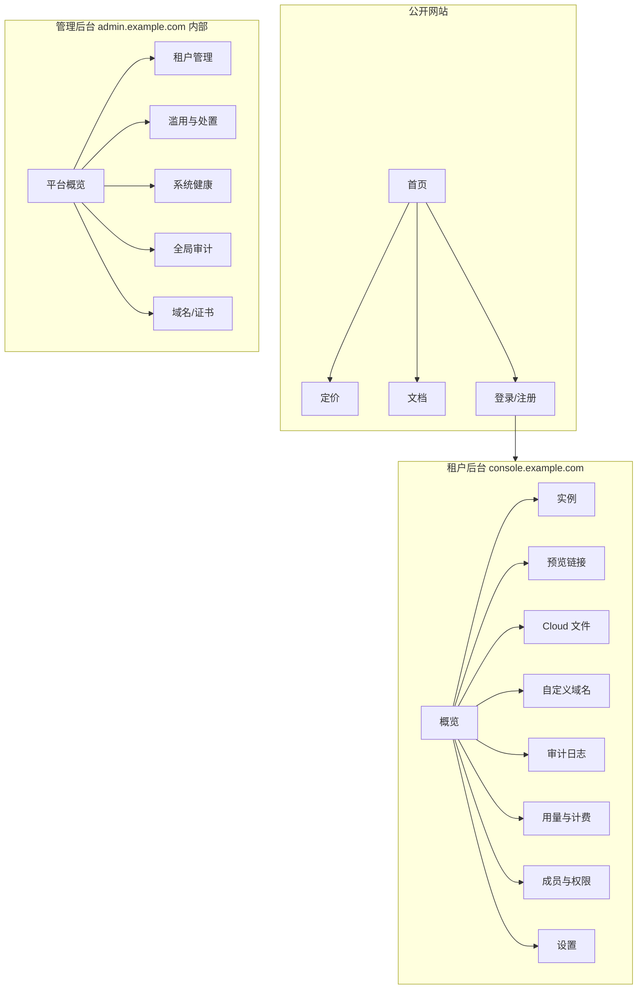

# APAGE UI Spec

本文件描述 APAGE 的前端界面规范，覆盖三类前端表面：

```text
公开网站（Marketing + Docs + Auth）
租户后台（Tenant Console，客户自助管理）
管理后台（Admin Console，平台内部运营）
```

并定义三者统一的设计语言与组件库。与 `apage-spec.md` 的数据模型、API 和安全约定对齐；术语（Tenant、User、Instance、Preview Link、File、File Ref、Quota 等）以产品 spec 为准。

视觉基调：**技术极简**（参照 Linear / Vercel / Stripe），中性灰底 + 单一强调色，信息密度高，支持深浅双主题。

---

## 1. 设计原则

```text
清晰优先：安全敏感产品，状态和边界必须一眼可辨（文件在本地还是云端、链接是否过期/撤销）
信息密度：面向开发者和运维，表格密集、操作高效，不为留白牺牲效率
渐进披露：常用操作前置，高风险/高级操作折叠在二级入口
可信感：脱敏默认、二次确认、清晰的权限与审计反馈，传递安全可靠
一致性：三个表面共用同一套 token 和组件，仅信息密度和导航结构不同
无障碍达标：WCAG 2.1 AA，键盘可达，对比度合规
```

---

## 2. 设计语言（Design Tokens）

所有颜色用 CSS variable 表达，支持 `light` / `dark` 双主题切换。下列为语义 token，组件只引用语义 token，不直接写死色值。

### 2.1 色彩

中性色板（Slate）：

```text
--color-bg            页面背景        light #FFFFFF / dark #0B0D12
--color-bg-subtle     次级背景/卡片底  light #F7F8FA / dark #12151C
--color-bg-muted      更深分区        light #EEF0F4 / dark #1A1E27
--color-border        边框/分隔线      light #E2E5EA / dark #232834
--color-border-strong 强边框/输入框    light #C9CED6 / dark #323847
--color-text          主文字          light #0B0D12 / dark #E6E9EF
--color-text-muted    次要文字        light #5B6472 / dark #9AA3B2
--color-text-subtle   占位/禁用       light #8A92A0 / dark #6B7480
```

强调色（Primary，Indigo）：

```text
--color-primary       #4F46E5
--color-primary-hover #4338CA
--color-primary-fg    #FFFFFF（强调色上的文字）
--color-primary-subtle  light #EEF0FF / dark #1E1B4B（弱底，用于选中态/标签）
```

语义色（状态）：

```text
--color-success  #16A34A   ready / online / verified
--color-warning  #D97706   pending / scanning / expiring soon
--color-danger   #DC2626   failed / rejected / offline / revoked
--color-info     #2563EB   informational
每个语义色配套 -subtle 弱底版本，用于 Badge 和 Banner
```

色彩使用规则：

```text
强调色只用于主操作、关键链接和选中态，避免泛滥
状态色只用于状态表达，不用于装饰
深浅主题对比度均需 >= 4.5:1（正文）/ 3:1（大字和图标）
不能仅靠颜色传达状态，必须配文字或图标（无障碍）
```

### 2.2 字体

```text
--font-sans   ui-sans-serif, Inter, "PingFang SC", "Microsoft YaHei", system-ui, sans-serif
--font-mono   ui-monospace, "JetBrains Mono", "SF Mono", Menlo, monospace
```

排版尺度（type scale，单位 px / line-height）：

```text
display   32 / 40   700   页面级标题（营销页）
h1        24 / 32   600   页面标题
h2        20 / 28   600   区块标题
h3        16 / 24   600   卡片标题
body      14 / 22   400   正文（后台默认）
body-lg   16 / 24   400   营销页正文
caption   12 / 16   400   辅助说明、表格次要列
mono      13 / 20   400   ID、token、URL、路径、代码
```

```text
后台默认正文 14px，保证信息密度
所有机器标识（link_id、file_ref、subdomain、secret 占位、hash）一律用 mono
```

### 2.3 间距、圆角、阴影

间距（4px 基准）：

```text
--space-1 4   --space-2 8   --space-3 12   --space-4 16
--space-5 24  --space-6 32  --space-8 48   --space-10 64
```

圆角：

```text
--radius-sm 4    输入框、Badge
--radius-md 8    按钮、卡片
--radius-lg 12   弹层、模态框
--radius-full 9999  头像、圆形图标按钮
```

阴影（克制，深色主题以边框为主、阴影更弱）：

```text
--shadow-sm   悬浮按钮/输入聚焦
--shadow-md   下拉、Popover
--shadow-lg   模态框、抽屉
```

### 2.4 栅格与布局

```text
营销页：12 列栅格，最大内容宽 1200px，左右安全边距 24px
后台：左侧固定导航 + 右侧内容区
  侧栏宽 240px（可折叠到 64px 图标态）
  内容区最大宽 1280px，表格类页面可全宽
断点：sm 640 / md 768 / lg 1024 / xl 1280
```

---

## 3. 通用组件库

三个表面共用。每个组件列出变体与关键状态。

```text
Button         primary / secondary / ghost / danger；尺寸 sm/md；loading / disabled 态
IconButton     图标按钮，带 tooltip
Input/Textarea 默认/聚焦/错误/禁用；带前后缀、字数计数
Select         单选下拉，支持搜索
Combobox       带搜索的多选/标签输入（如 ipAllowlist、allowedUserIds）
Checkbox/Radio/Switch
Badge          状态徽标，语义色 + -subtle 底，文字+图标双编码
Tag            可移除标签（过滤条件、allowlist 条目）
Table          密集表格：排序、列宽、行选择、行内操作、空态、加载骨架
Pagination     cursor 分页：上一页/下一页 + 每页条数（对齐 spec 列表约定，不显示总页数）
Tabs           页面内分区切换
Card           信息卡片，含标题、操作区、内容
Modal          确认/表单弹窗，含危险确认变体（需输入确认）
Drawer         右侧抽屉，用于详情和创建表单
Toast          操作反馈（成功/错误/信息），右上角，自动消失
Banner         页面级提示（配额超限、Agent 离线、合规提示），可关闭/常驻
Tooltip        悬浮说明
CopyField      只读字段 + 一键复制（URL、ID、TXT 记录、安装命令）
SecretReveal   一次性密钥展示：默认遮蔽，点击显示，含「仅显示一次」警示
CodeBlock      mono 代码块 + 复制（CLI 命令、curl、配置片段）
StatusDot      在线/离线圆点 + 文案
EmptyState     空态：图标 + 一句说明 + 主操作
Skeleton       加载骨架
Stat           指标卡：数值 + 标签 + 同比/趋势
DateRange      时间区间选择（日志、用量过滤）
ConfirmDialog  二次确认（撤销链接、删除文件、轮换密钥）
```

---

## 4. 通用交互模式

### 4.1 状态可视化（Badge 映射）

与 `apage-spec.md` 状态机一致：

```text
Instance.status   online=success / offline=danger
File.status       created=muted / uploading=info / uploaded=info /
                  scanning=warning / converting=warning / ready=success /
                  rejected=danger / failed=danger / expired=muted / deleted=muted
PreviewLink       active=success / expiring(<24h)=warning / expired=muted /
                  revoked=danger / frozen=danger
Custom Domain     pending=warning / verified=success / failed=danger
```

### 4.2 危险与不可逆操作

```text
撤销链接、删除文件、轮换/撤销密钥、冻结实例、删除自定义域名：均需二次确认
高破坏性操作（删除文件、轮换密钥、冻结/封禁）：ConfirmDialog 要求输入资源名或关键字确认
所有此类操作成功后弹 Toast，并提示已写入审计日志
```

### 4.3 脱敏与密钥展示

```text
默认脱敏：token、secret、完整含 secret 的 URL、密码 hash
列表和日志中只显示 link_id / 定位 ID，绝不显示 secret path segment
密钥仅在创建时通过 SecretReveal 明文显示一次，关闭后不可再查看，仅能轮换
复制含 secret 的 URL 时给出「请妥善保存，勿粘贴到公共渠道」提示
```

### 4.4 加载、空态、错误

```text
加载：表格/卡片用 Skeleton，按钮用 inline loading，不用整页 spinner
空态：EmptyState 给出下一步主操作（如「创建第一个预览链接」）
错误：表单字段级错误就近显示；接口错误用 Banner/Toast，附 requestId 便于排查
401/403：跳转登录或显示无权限页；404 资源不存在统一文案，不暴露跨租户信息
```

### 4.5 实时性

```text
Instance 在线状态、File 处理状态、Custom Domain 验证状态需轮询或 SSE 刷新
关键状态变化（文件 ready、域名 verified、链接被冻结）给 Toast 或 Banner 提示
撤销链接后列表状态需 <= 5s 内反映（对齐 SLO）
```

---

## 5. 信息架构



```text
公开网站独立域名（example.com），营销与文档
租户后台 console.example.com，登录后进入，RBAC 控制可见功能
管理后台 admin.example.com，仅平台员工，独立鉴权 + 强制 SSO/MFA，公网隔离或 IP 白名单
预览页（p/ 与 f/ 链接）属于面向访客的运行时表面，单列于第 9 节
```

---

## 6. 公开网站

### 6.1 首页 Landing

```text
目的：讲清 APAGE 是面向 Agent 生态的 Preview & Share Provider
区块：
  Hero：一句话价值主张 + 主 CTA（开始使用）+ 次 CTA（看文档）
  三种模式对比：DNS-only / Tunnel relay / Cloud（对齐 spec 24 节产品边界）
  服务对象：OpenClaw / Hermes / Custom Agent 的接入示意
  能力亮点：临时链接、二级域名、TLS、撤销、病毒扫描、沙箱预览
  代码示例：CLI / MCP tool 创建链接的最小片段（CodeBlock）
  安全与信任：脱敏、高熵 secret、可撤销、审计
  CTA Footer
```

### 6.2 定价 Pricing

```text
套餐卡片：Lite(免费) / Starter / Pro / Team，对齐 spec 20 节
每卡：价格、实例数、流量/存储额度、保留时长、自定义域名/SSO/审计/SLA 标识
计费维度说明：Tunnel（实例数/转发流量/域名）与 Cloud（存储/下载/转换/保留）
Lite 边界清晰标注：仅平台二级域名、链接/文件最长 24h、无自定义域名与 SLA、超额提示升级不自动扣费
FAQ：数据是否上传、Tunnel relay 是否经过平台、如何计费
```

### 6.3 文档 Docs

```text
快速开始：安装 Agent（含 checksum 校验提示）、init、创建第一个链接
集成指南：OpenClaw CLI helper / Hermes adapter / Custom Agent 本机 HTTP API + MCP tool
API 参考：preview-links、files、uploads、列表与分页、错误码、幂等
安全模型：三种数据流向、allowlist、路径校验、沙箱预览
自定义域名配置：TXT 验证 + CNAME，含 DNS 诊断说明
左侧目录树 + 右侧锚点导航 + 全局搜索；代码块支持复制和语言切换
```

### 6.4 登录 / 注册 Auth

```text
注册：邮箱 + 密码 或 OAuth（对齐 User.auth_provider）
邮箱验证流程（email_verified_at）
登录：密码 / OAuth；失败限流提示
忘记密码、重置流程
注册即创建首个 Tenant（owner 角色），可后续加入其他 Tenant
极简居中卡片布局，左侧可放品牌插画/价值主张
```

---

## 7. 租户后台（Tenant Console）

布局：左侧导航（概览/实例/预览链接/Cloud 文件/自定义域名/审计日志/用量与计费/成员/设置）+ 顶栏（租户切换器、当前 plan 徽标、用量预警、用户菜单）。所有功能受 RBAC 约束（owner/admin/member/viewer，见 spec §2 Membership）。

### 7.1 概览 Overview

```text
顶部 Stat 卡：在线实例数 / 活跃链接数 / 本周期存储用量 / 本周期流量用量
配额预警 Banner：任一维度接近上限时显示，带「查看用量」「升级」入口
最近分享：最近创建的预览链接列表（前 N 条，可跳转完整列表）
实例状态摘要：各实例 online/offline + last_seen
新手引导（空租户）：EmptyState 引导安装 Agent / 创建链接
```

### 7.2 实例 Instances

列表页：

```text
列：agent_name / agent_type(openclaw|hermes|custom) / subdomain / mode(tunnel|cloud|hybrid)
    status(StatusDot) / agent_version / last_seen_at
行操作：查看详情、复制 subdomain
过滤：status、agent_type、mode；搜索 agent_name
顶部操作：添加实例（引导安装命令）
```

实例详情（Drawer 或子页）：

```text
基本信息：instance_id、subdomain、mode、version、连接时长、所属 region
连接健康：当前 session、reconnect 次数、心跳状态、协议版本
allowlist 目录：展示 Agent 上报的 allowlist（只读）
  说明文案：目录只能在客户服务器本地配置，后台不能远程扩大范围
  「发起 allowlist 变更请求」按钮 -> 生成变更请求，提示需客户服务器本机确认
版本提示：低于最低支持版本时显示升级 Banner
危险区：吊销该实例 token（二次确认 + 输入实例名）
```

### 7.3 预览链接 Preview Links

列表页（核心页）：

```text
列：displayName / 定位 link_id(mono) / mode(tunnel|cloud) / 关联 instance /
    access_policy 摘要 / 状态 Badge / expires_at（相对时间 + 悬浮绝对时间）/
    view_count / last_accessed_at
不显示：secret、完整含 secret 的 URL（仅在创建时一次性展示）
过滤：status(active/revoked/expired/frozen)、mode、instance、时间区间
排序：created_at desc（cursor 分页，不显示总数）
行操作：复制链接（带保管提示）、查看详情、撤销（二次确认）
批量操作：批量撤销（二次确认）
```

创建链接（Drawer 表单）：

```text
模式选择：tunnel（选 file_ref / 由 Agent 注册）或 cloud（选 ready 文件）
  非 ready 的 Cloud 文件不可选，给出状态提示
有效期：expiresInSeconds，受底层 file/file_ref 寿命裁剪并提示实际 expiresAt
访问策略 access_policy：
  类型：public_token / password / account / ip_allowlist / single_use
  allowDownload 开关（注明 download_disabled 仅尽力而为）
  maxViews、singleUse
  password：设置密码（强度校验，注明只存哈希、错误会限流）
  ip_allowlist：CIDR 列表（Combobox）
  account：allowedUserIds / allowedTenantIds
创建成功：SecretReveal 展示完整 URL（含 secret），强调仅显示一次 + 复制 + 保管提示
```

链接详情（Drawer）：

```text
状态、模式、关联文件/实例、过期、访问统计（view_count、last_accessed_at）
访问策略详情
访问记录摘要（指向审计日志已过滤视图）
操作：撤销、（如支持）调整过期/密码
被冻结的链接显示冻结原因与申诉入口（对齐滥用治理）
```

### 7.4 Cloud 文件 Files

```text
列表列：displayName / file_id / status Badge / size / mime_type / expires_at
状态流转可视化：scanning/converting 显示进度态，rejected/failed 显示原因
行操作：查看详情、为 ready 文件创建预览链接、删除（二次确认 + 输入文件名）
上传：直传（<=8MiB，对齐 spec 阈值）或预签名上传；上传中显示进度
  上传后轮询状态直到 ready
删除提示：删除 File 会级联删除衍生产物并使其所有链接失效
空态：引导上传或改用 Tunnel 模式
```

### 7.5 自定义域名 Custom Domains

```text
列表：domain / 状态(pending/verified/failed) / 证书状态 / 最近检查时间
添加域名向导（分步）：
  1. 输入域名
  2. 展示 TXT 验证记录（CopyField）：_apage.<domain> TXT apage-domain-verify=xxx
  3. 展示 CNAME 记录（CopyField）：<domain> CNAME customer-id.preview.example.com
  4. 「检查 DNS」按钮，轮询验证与签证书进度
  5. 激活成功
失败诊断：DNS 未生效/记录错误时显示可操作诊断（期望值 vs 实测值）
证书自动续期状态展示；续期失败告警
受 plan 的 custom_domain_limit 约束，超限提示升级
```

### 7.6 审计日志 Audit Logs

```text
表格列：created_at / event / actor_type / actor_id / resource_type / resource_id /
        ip / reason
过滤：event、resource_type、actor_type、时间区间（DateRange）、resource_id
事件覆盖 spec 15/15.5 节全部事件类型
secret path segment 一律脱敏，不出现在任何列
cursor 分页；支持导出（CSV，受 plan 限制，Team 起）
仅 admin/owner 可见完整审计；member 可见与自己相关的子集
```

### 7.7 用量与计费 Usage & Billing

```text
用量仪表盘（按当前计费周期）：
  存储用量 / Tunnel egress / Cloud egress / 转换次数 / 实例数 / 域名数
  每项显示 已用 vs 上限（进度条），接近上限高亮
  趋势图（按天）
计费信息：当前 plan、计费维度说明、下一周期续费
升级/降级入口
超额行为说明：Lite 提示升级不自动扣费；付费套餐按 spec 计费维度计量
仅 owner 可见计费与变更套餐；admin 可见用量
```

### 7.8 成员与权限 Members

```text
成员列表：user email / role(owner/admin/member/viewer) / 加入时间 / 状态
邀请成员：邮箱 + 角色；待接受邀请单独分组
角色变更、移除成员（二次确认）
权限说明表：四种角色可做什么（对齐 spec §2 角色权限）
至少保留一个 owner 的约束校验
仅 owner/admin 可管理成员
```

### 7.9 设置 Settings

```text
租户资料：name、默认过期时间、默认模式
安全：instance_api_key 列表，创建/轮换/撤销（SecretReveal 一次性展示；撤销即失效）
  agent_token 管理（轮换即断连提示）
数据与合规：数据驻留 region 展示、发起数据删除请求（GDPR/CCPA，二次确认）
通知：用量预警、安全事件、滥用冻结的通知渠道
危险区：删除租户（owner，强确认 + 输入租户名）
```

---

## 8. 管理后台（Admin Console）

平台内部运营使用。独立域名、独立鉴权，强制 SSO + MFA，公网隔离或 IP 白名单。所有操作高敏，全部写审计，默认脱敏，遵循最小权限。

### 8.1 平台概览

```text
全局 Stat：在线 Agent 总数 / 活跃链接 / 今日访问 / 处置中滥用工单 / 系统告警数
关键 SLO 实时面板：Preview API 可用性、tunnel 首字节 P95、revoke 生效、转换队列延迟
进行中告警列表（对齐 spec 18 节告警项）
```

### 8.2 租户管理 Tenants

```text
租户列表：tenant / plan / trust_level(new/basic/trusted) / 实例数 / 用量 / 创建时间 / 状态
搜索/过滤：plan、trust_level、状态（active/suspended）
租户详情：基本信息、成员、实例、用量、近期审计、滥用记录
运营操作（全部二次确认 + 写审计）：
  调整 trust_level、调整配额/套餐、暂停/恢复租户、冻结实例
跨租户资源查询需明确审计，禁止查看文件明文内容（仅元数据）
```

### 8.3 滥用与处置 Abuse

```text
工单队列：来源(用户举报/扫描命中/黑名单命中) / 资源 / 严重级 / 状态 / SLA 倒计时
来源对齐 spec 15.5：abuse.reported / flagged_by_scanner / blacklist_hit
处置面板（分级，对齐 spec）：
  冻结单链接 -> 冻结实例 -> 冻结租户 -> 永久封禁并加入内部黑名单
  takedown / DMCA 受理与处置记录
高危内容（钓鱼/恶意软件/CSAM）：1 小时 SLA 高亮；CSAM 走法律上报流程并保全证据
处置动作全部二次确认、记录处置人、写审计（link.frozen / instance.frozen / tenant.suspended / takedown.*）
申诉处理视图：查看租户申诉、复核、恢复
不在界面直接渲染被举报的不可信内容，仅显示元数据与安全沙箱预览
```

### 8.4 系统健康 System Health

```text
组件状态：Preview API / Tunnel Gateway / Workers(scanner/converter) / Redis / PG / 对象存储
Gateway 视图：各 Gateway active_connections / streams / egress / event_loop_latency
队列：scanner / converter 队列长度与等待时延
存储：删除重试 backlog、对象存储异常
容量指标对照（对齐 spec 19.8 扩容指标），超阈值高亮
故障场景指引链接（对齐 spec 19.9）
```

### 8.5 全局审计 Audit

```text
跨租户审计检索：按 tenant/event/actor/资源/时间
管理后台自身操作审计单独可追溯（谁冻结了什么、谁调了配额）
导出与留存策略展示（默认 90 天，合规可调）
```

### 8.6 域名与证书 Domains & Certs

```text
自定义域名总览：验证状态、证书签发/续期状态、即将过期清单
ACME 签发失败、续期失败的运维视图与重试
render 域名声誉监控（Safe Browsing / 黑名单命中），对齐滥用治理
```

---

## 9. 访客预览页（Runtime）

面向链接访问者，非登录用户。属运行时表面，样式从设计语言，但极简、无后台导航。

```text
预览页骨架：顶部极简条（displayName + 下载按钮，受 allowDownload 控制）+ 内容区
内容区按类型渲染（对齐 spec 13 节与分类型 CSP）：
  PDF：原生预览；图片：居中预览；文本/MD/JSON/CSV/LOG：代码/表格预览
  HTML/SVG：独立 render 域名 + sandbox iframe，显著「不可信内容」提示
密码页：password 策略链接显示密码输入（错误限流提示，不泄露是否存在）
账户页：account 策略要求登录后访问
失效页：过期(410)/撤销/冻结/不存在(404) 统一友好文案，不暴露跨租户信息
  冻结页可显示申诉入口
被举报入口：每个公开预览页提供显著「举报滥用」入口，无需登录
所有预览页：no-referrer、脱敏 URL、不缓存敏感内容（对齐 spec 安全响应头）
```

---

## 10. 响应式与无障碍

响应式：

```text
营销页：移动优先，完整自适应
租户后台：lg 以上左侧栏常驻；md 以下侧栏抽屉化、表格转卡片或横向滚动
管理后台：以桌面为主，平板可用，不强制移动适配
预览页：完整移动适配（访客多为移动端打开）
```

无障碍（WCAG 2.1 AA）：

```text
全键盘可达，可见 focus ring（--color-primary 2px outline）
状态不仅靠颜色，配图标/文字
对比度：正文 >= 4.5:1，大字/图标 >= 3:1
表单字段关联 label，错误用 aria-describedby
模态/抽屉焦点陷阱与 Esc 关闭
动效尊重 prefers-reduced-motion
```

---

## 11. 国际化与文案

```text
首批支持中文、英文，文案走 i18n key，不硬编码
时间：相对时间为主（3 分钟前），悬浮显示绝对时间 + 时区
数字/字节：本地化格式（1.2 GB、183 KB）
安全文案统一口径：明确区分 DNS-only / Tunnel relay / Cloud 的数据流向（对齐 spec 24 节）
危险操作文案明确后果，不用模糊措辞
```

---

## 12. 前端技术对齐

```text
框架：Next.js（对齐 spec 23 节）
样式：CSS variables 实现 token 与深浅主题；可选 Tailwind 映射上述 token
组件：统一组件库（第 3 节），三端复用
状态/数据：与 apage-api REST 对接，遵循 cursor 分页、Idempotency-Key、错误 envelope（含 requestId）
鉴权：租户后台用户登录态/OAuth；管理后台独立 SSO + MFA
预览页与 render 域名严格隔离，遵循分类型 CSP 与 sandbox 约定
实时：File 处理、Instance 在线、域名验证用轮询或 SSE
```

---

## 13. 与产品 spec 的对应关系

```text
数据模型/术语        apage-spec.md 2 节（Tenant/User/Membership/Quota/Instance/FileRef/File/PreviewLink）
访问策略 UI          14 节 权限模型
状态 Badge 映射      11 节 文件状态 / 各实体 status
审计日志页           15 / 15.5 节 审计事件
滥用处置后台         15.5 节 滥用治理
合规与数据删除       15.6 节
用量与计费           20 节 计费 + Quota 实体
自定义域名向导       5 节 DNS 与域名
列表分页/幂等/限流   统一 API 约定
SLO 健康面板         18 节 可观测性与 SLO
```
